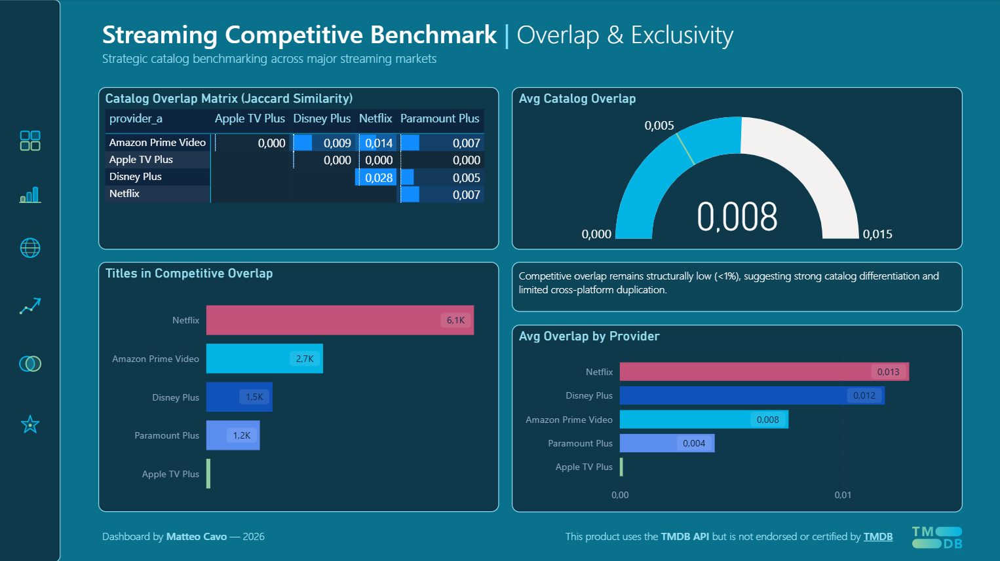

# 🎬 Streaming Competitive Benchmark

Strategic catalog benchmarking across major streaming markets.

This project analyzes how major streaming platforms differentiate their content catalogs across scale, recency, international reach, genre strategy, quality and competitive overlap.

**Platforms analyzed:** Netflix · Amazon Prime Video · Disney Plus · Apple TV Plus · Paramount Plus

**Markets analyzed:** DE · ES · FR · GB · IT · KR · US

---

## 🔹 Data Source

All title-level metadata used in this project is sourced from the TMDB (The Movie Database) API.

Data includes:
- Title metadata (movie / TV)
- Release year
- Genres
- Origin country
- Language
- Popularity
- Vote average
- Vote count

The dataset is collected programmatically via the TMDB API under its terms of service.

Official website: https://www.themoviedb.org/  
API documentation: https://developer.themoviedb.org/

> *This product uses the TMDB API but is not endorsed or certified by TMDB.*

Raw API responses are stored locally and not redistributed in this repository.
Only derived analytical datasets are versioned.

---

## 🔗 Live Dashboard

👉 **[View Interactive Power BI Dashboard](https://app.powerbi.com/view?r=eyJrIjoiMDVhNGNjNWQtYTc2YS00YmI0LTk2NzctMTcwNWU5OGM0MmM0IiwidCI6IjgwNjZmMmRlLTgxZDctNGVjNC04Y2E5LTgzNzVjOTA4NjViNSJ9)**

Full dashboard documentation: 📄 [`dashboard/README.md`](dashboard/README.md)

---

## 📊 Project Architecture

```
Streaming_Benchmark_Project/
│
├── notebooks/
│   ├── README.md                         # Pipeline documentation
│   ├── 01_ingestion.ipynb                # TMDB API data collection
│   ├── 02_cleaning.ipynb                 # Normalization & deduplication
│   └── 03_build_mart.ipynb               # Analytical mart construction
│
├── data/
│   ├── raw/                              # Raw API responses (gitignored)
│   ├── clean/                            # Normalized data (gitignored)
│   └── mart/
│       ├── provider_catalog_mart.parquet
│       ├── provider_market_metrics.parquet
│       └── overlap_matrix.parquet
│
├── dashboard/
│   ├── screenshots/                      # Dashboard page exports
│   └── README.md                         # Dashboard documentation
│
├── requirements.txt
└── README.md
```

---

## 📓 Notebooks

Three-stage pipeline: collection → cleaning → mart build.

Full documentation: 📄 [`notebooks/README.md`](notebooks/README.md)

### `01_ingestion.ipynb` — Data Collection
Queries the TMDB API across a 5 providers × 7 markets grid. Handles pagination and rate limiting. Exports raw data to Parquet.

### `02_cleaning.ipynb` — Data Preparation
Normalizes schema, deduplicates by `tmdb_id`, standardizes country codes, assigns recency buckets and computes weighted ratings.

### `03_build_mart.ipynb` — Analytical Mart
Builds three tables at different analytical grains: title-level, provider × market, and provider-pair. See [`notebooks/README.md`](notebooks/README.md) for full column documentation.

---

## 📈 Analytical Dimensions

| Dimension | Description |
|---|---|
| **Catalog Scale** | Total unique titles per provider and market |
| **Recency Investment** | Share and intensity of recent content |
| **Content Quality** | Vote-weighted quality scoring |
| **International Exposure** | Non-local content share and language diversity |
| **Genre Concentration** | Herfindahl index on primary genre distribution |
| **Competitive Overlap** | Jaccard similarity across all provider pairs |

---

## 📸 Dashboard Preview

### Executive Overview


### Overlap & Exclusivity


For the full dashboard breakdown and documentation → 👉 [`dashboard/README.md`](dashboard/README.md)

---

## 🛠️ Tech Stack

| Tool | Usage |
|---|---|
| Python 3 | Data pipeline |
| `requests` | TMDB API calls |
| `pandas` | Data transformation |
| `pyarrow` | Parquet I/O |
| Power BI Desktop | Dashboard & visualization |
| DAX | Analytical measures |

---

## ⚙️ Setup

```bash
git clone https://github.com/matteocavo/streaming-benchmark
cd streaming-benchmark
pip install -r requirements.txt
export TMDB_API_KEY="your_api_key_here"
```

Run notebooks in order — see [`notebooks/README.md`](notebooks/README.md) for details.

---

## ⚠️ Dataset Limitations

| Limitation | Impact |
|---|---|
| **TMDB catalog coverage** | TMDB reflects reported availability, not contractual licensing. Some titles may be missing or misclassified by provider |
| **Partial market coverage** | Amazon Prime Video data available only for DE, GB, US — TMDB does not map flatrate availability for IT, FR, ES, KR. Paramount Plus available only for US, GB, FR |
| **Watch provider API constraints** | TMDB `/watch/providers` endpoint returns current availability — historical catalog changes are not captured |
| **Popularity bias** | `popularity` score is TMDB-internal and recency-weighted. Older titles are systematically underscored regardless of cultural relevance |
| **Vote coverage** | A significant portion of titles have `vote_count = 0`, particularly Amazon originals and niche content. Titles with no votes receive `weighted_rating = 0` — aggregate quality metrics reflect this penalization rather than excluding unrated titles |
| **Language normalization** | `original_language` reflects primary production language — multilingual co-productions are assigned a single code |

These limitations do not invalidate the analysis but should be considered when interpreting absolute values. Relative comparisons across providers within the same dataset remain valid.

---

## 📄 License

Portfolio project. Data sourced from the TMDB API under their terms of service.

---

*Matteo Cavo — 2026*
