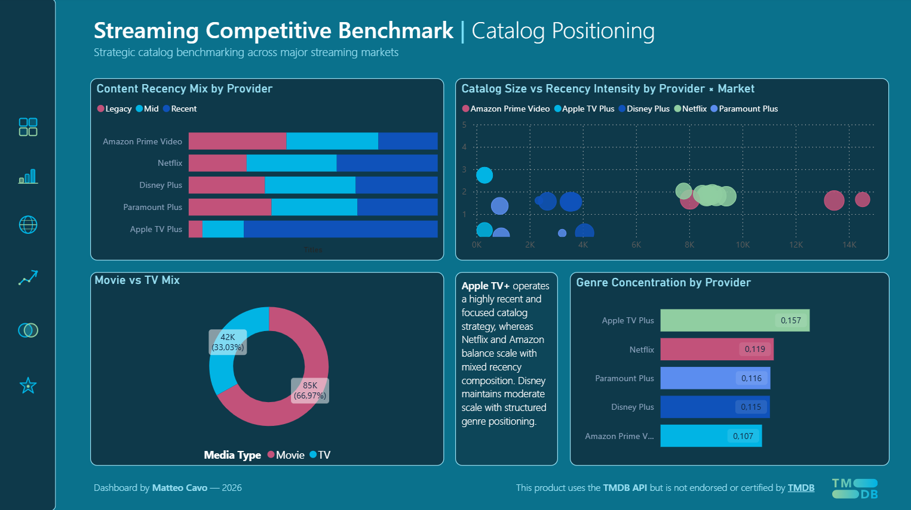
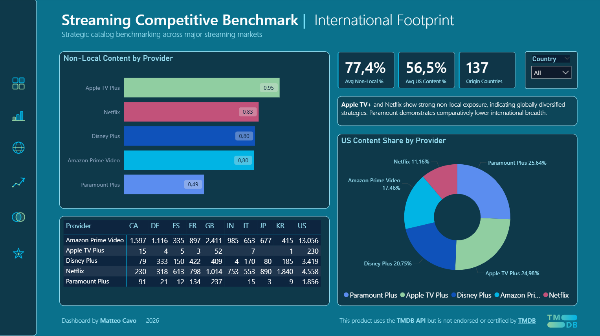
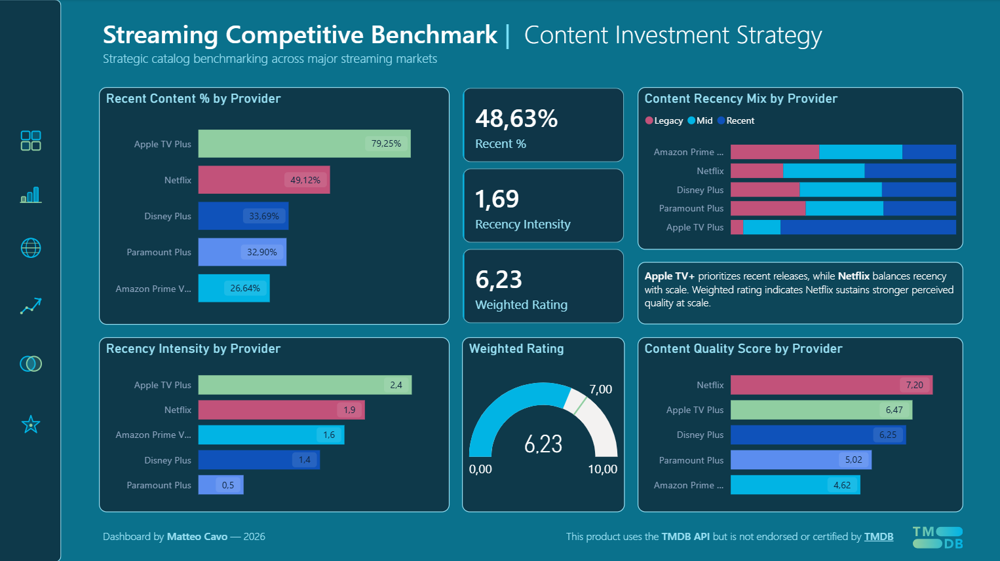
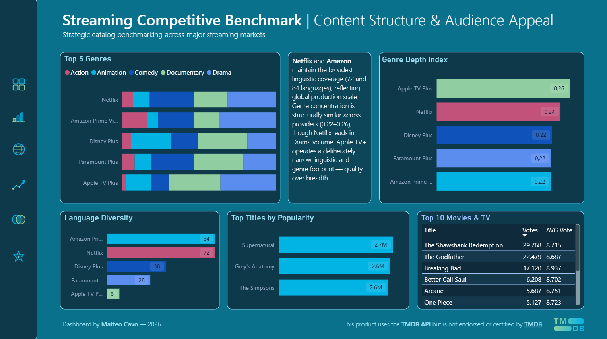

# 📊 Streaming Competitive Benchmark — Dashboard

Strategic catalog benchmarking across major streaming markets.

Interactive executive dashboard analyzing catalog differentiation across five major streaming platforms in seven global markets.

> *This product uses the TMDB API but is not endorsed or certified by TMDB.*

---

## 🔗 Live Dashboard

👉 **[View Interactive Dashboard](https://app.powerbi.com/view?r=eyJrIjoiMDVhNGNjNWQtYTc2YS00YmI0LTk2NzctMTcwNWU5OGM0MmM0IiwidCI6IjgwNjZmMmRlLTgxZDctNGVjNC04Y2E5LTgzNzVjOTA4NjViNSJ9)**

---

## 📘 Dashboard Structure

### 1️⃣ Executive Overview


High-level benchmarking across Total Titles, Markets Covered, Recent Content %, Recency Intensity, Genre Concentration and International Diversification.

**Key insight:** Platforms follow structurally different catalog strategies — scale vs freshness vs diversification.

---

### 2️⃣ Catalog Positioning


Analyzes recency mix (Legacy / Mid / Recent), catalog size vs Recency Intensity, Movie vs TV split and genre concentration.

**Key insight:** Apple TV+ operates a focused, recent catalog. Netflix and Amazon balance scale with mixed recency. Disney positions structurally between both.

---

### 3️⃣ International Footprint


Evaluates non-local content %, US content share and origin country distribution across providers and markets.

**Key insight:** Netflix shows the broadest international production footprint. Apple TV+ and Netflix display the strongest non-local exposure across all providers.

---

### 4️⃣ Content Investment Strategy


Benchmarks Recent Content %, Recency Intensity, Weighted Rating and Quality Score by provider.

**Key insight:** Netflix uniquely combines scale and quality (7.2/10 at 61K titles). Apple TV+ prioritizes freshness over breadth.

---

### 5️⃣ Overlap & Exclusivity


Uses Jaccard similarity to measure catalog intersection across all platform pairs.

**Key insight:** Average Jaccard Similarity = 0.008 — structural differentiation across all providers (<1% overlap). Apple TV+ shows near-zero intersection. Disney exhibits the highest relative overlap.

---

### 6️⃣ Content Structure & Audience Appeal


Explores top 5 genres by provider, genre depth index, language diversity, top titles by popularity and top-rated movies & TV.

**Key insight:** Genre concentration is structurally similar across platforms (0.22–0.26). Apple TV+ operates a deliberately narrow linguistic and genre footprint — quality over breadth. Amazon and Netflix lead in language diversity (84 and 72 languages).

---

## 🧮 Data Model

```
DimProvider (calculated)
    └── canonical_provider (PK)
           ↓
           ├── provider_catalog_mart [canonical_provider]
           └── provider_market_metrics [canonical_provider]

DimMarket (calculated)
    └── country (PK)
           ↓
           ├── provider_catalog_mart [country]
           └── provider_market_metrics [country]

overlap_matrix (standalone — no relationships)
```

> `overlap_matrix` has no direct relationship with DimProvider — it operates at provider-pair grain rather than individual provider grain.

---

## 📁 Data Sources

| File | Grain |
|---|---|
| `provider_catalog_mart.parquet` | title × provider × market |
| `provider_market_metrics.parquet` | provider × market |
| `overlap_matrix.parquet` | provider pair |

Generated via Python pipeline — see [main README](../README.md).

---

*Dashboard by Matteo Cavo — 2026*
